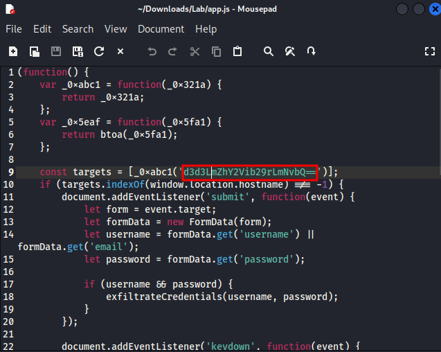
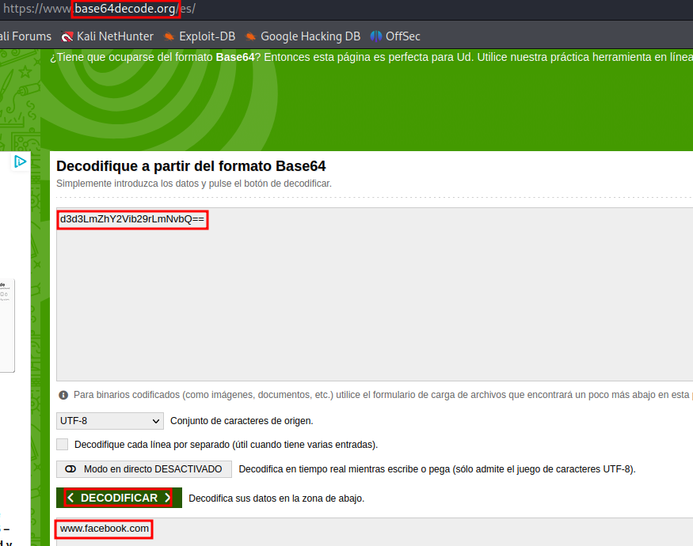
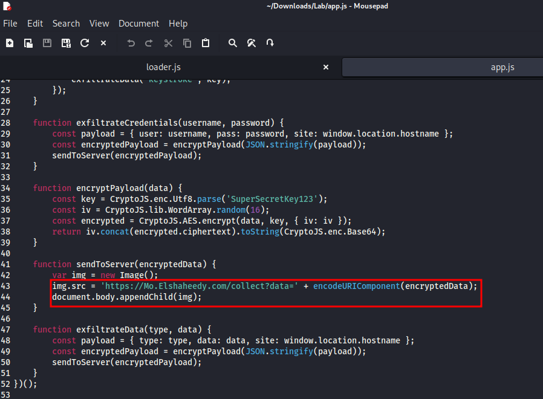
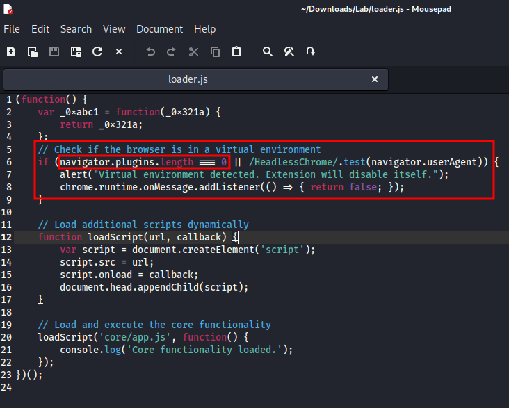
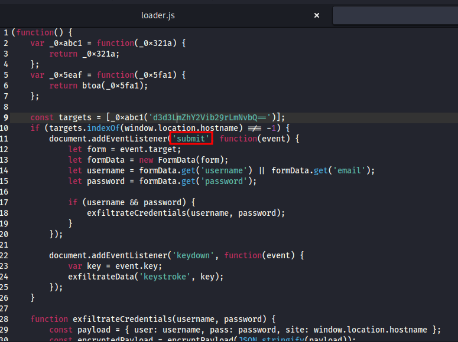
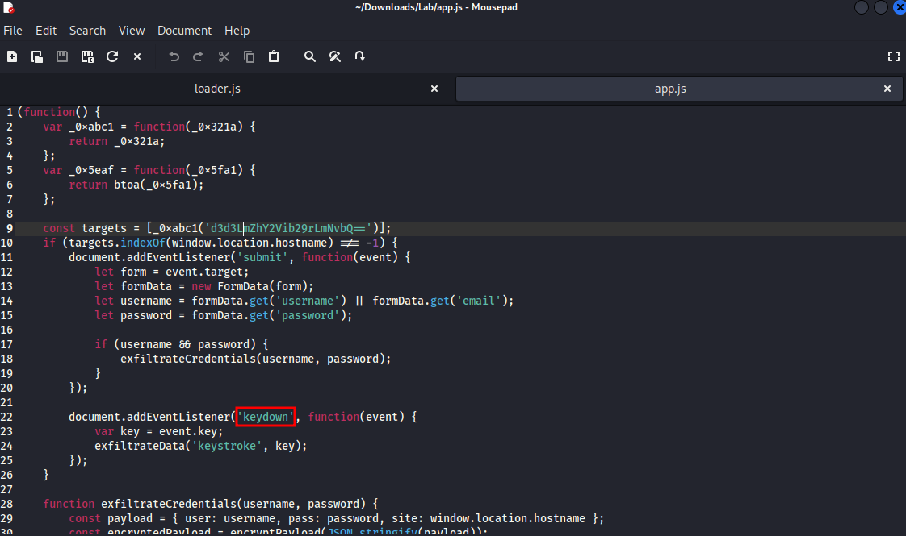
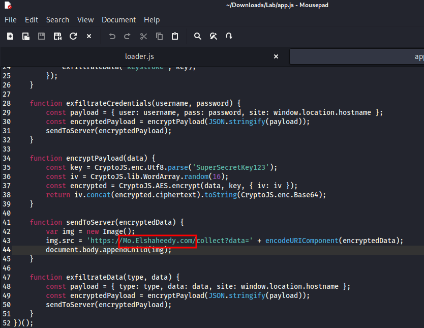
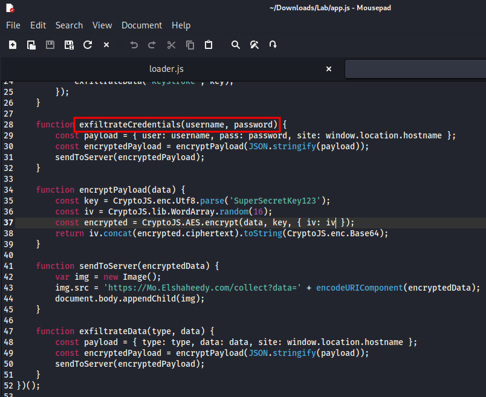
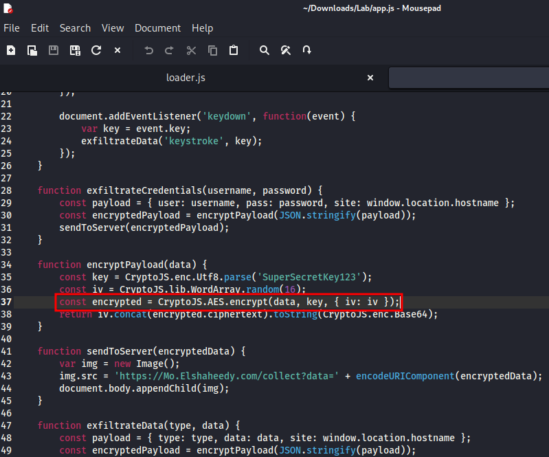
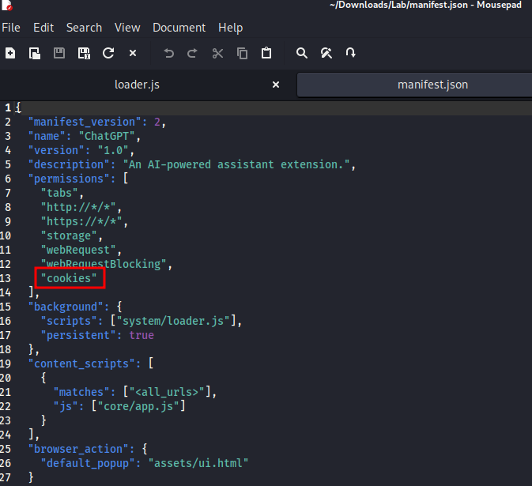

# Writeup - FakeGPT from CyberDefenders

Herramienta: base64 decoder

Autor: Miquel Navarro

Dificultad: Facil

Categoria: Malware Analysis

### Q1. Which encoding method does the browser extension use to obscure target URLs, making them more difficult to detect during analysis?

Tras analizar los artefactos que se nos proporcionan para resolver el caso, se puede ver que en "app.js" se encuentra la URL codificada.

Podemos saber de que tipo de codificación se trata entrando a una página online que nos lo diga o bien, si tenemos algo más de experiencia observando los símbolos "==" al final de la cadena.

#### Sol. Base64

### Q2. Which website does the extension monitor for data theft, targeting user accounts to steal sensitive information?

Continuando con la cadena de la primera pregunta, si la pasamos por un decodificador de base64 (cualquiera online nos vale), obtendremos la solución.

#### Sol. www.facebook.com

### Q3. Which type of HTML element is utilized by the extension to send stolen data?

Si seguimos investigando el mismo archivo, veremos que existe una función "sendToServer(EncryptedData)", en esta encontraremos lo que estamos buscando.

#### Sol. 

### Q4. What is the first specific condition in the code that triggers the extension to deactivate itself?

Para encontrar esta condición específica nos debemos mover al archivo "loader.js", en este encontramos dicha función en la que podremos ver hasta un mensaje escrito por el propio creador del archivo indicando lo que hace la función.

Esto normalmente se suele utilizar para detectar y evitar el análisis tanto estático como dinámico en entornos de virtualización y también la ejecución de sandbox. Este análisis que realiza no actúa como bypass sino que detiene o no llega realizar la ejecución del malware.

#### Sol. navigator.plugins.length === 0

### Q5. Which event does the extension capture to track user input submitted through forms?

En "app.js" encontramos implementado "addEventListener", que recoge de los formularios el "username" y "password"

#### Sol. submit

### Q6. Which API or method does the extension use to capture and monitor user keystrokes?

Si seguimos investigando en el mismo archivo que en la pregunta anterior, podemos encontrar el "keystroke" de una forma clara

#### Sol. keydown

### Q7. What is the domain where the extension transmits the exfiltrated data?

En la misma función que en la pregunta 3, podemos ver a que servidor envía los datos

#### Sol. Mo.Elshaheedy.com

### Q8. Which function in the code is used to exfiltrate user credentials, including the username and password?

En el mismo archivo también encontramos la función que exfiltra las credenciales

#### Sol. exfiltrateCredentials(username, password);

### Q9. Which encryption algorithm is applied to secure the data before sending?

El algoritmo lo encontramos en este mismo archivo, en la función "encryptPayload(data)"

#### Sol. AES

### Q10.

En el archivo manifest tenemos los permisos que se deben otorgar a la nueva extensión. Uno de estos nos permitirá tener acceso a las cookies del navegador.

#### Sol. cookies
