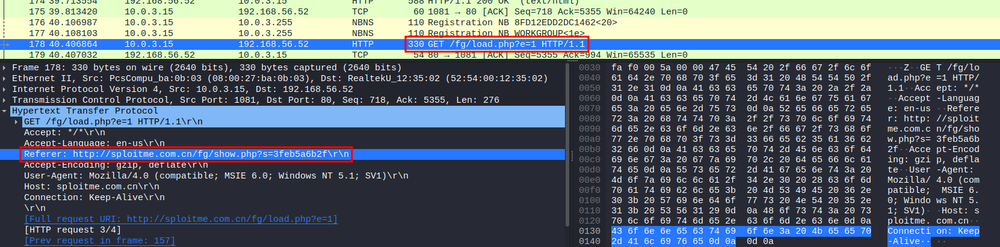

# Writeup - NukeTheBrowser from CyberDefenders
 
Herramientas: Wiresahark, Network Miner, Cyberchef y scdbg

Autor: Miquel Navarro

Dificultad: Difícil

Categoria: Network Forensics

### Q1. Multiple systems were targeted. Provide the IP address of the highest one.

En primer lugar, abriremos la captura .pcap con la aplicación Wireshark.
Accedemos a "Statistics > Conversations" abrimos el apartado de "IPv4" y ordenamos de manera descendente la lista "Address A".

### Q2. What protocol do you think the attack was carried over?

Para saber en que protocolo han realizado el ataque accedemos a "Statistics > Protocol Hierarchy Statistics" y podemos observar que se ha utilizado bastante el protocolo HTTP por lo que es probable que sea ese.

### Q3. What was the URL for the page used to serve malicious executables (don't include URL parameters)?

Para encontrar la URL, siguiendo los paquetes en orden en Wireshark, en el paquete 178 observamos un GET sospechoso que resulta ser la página donde se enceuntran los ejecutables maliciosos.

Si accedemos a "Follow > TCP Stream" podemos ver la página exacta de donde se descargan.

### Q4. What is the number of the packet that includes a redirect to the french version of Google and probably is an indicator for Geo-based targeting?

En este caso, filtraremos los paquetes con la opción "dns.qry.name == "www.google.fr"" ya que .fr nos indica que es perteneciente a Francia 

Nos fijamos en el número de los paquetes obtenidos y quitamos el filtro para ver los paquetes anteriores donde vemos que el paquete 299 es el que encuentra la página.

### Q5. What was the CMS used to generate the page 'shop.honeynet.sg/catalog/'? (Three words, space in between)
