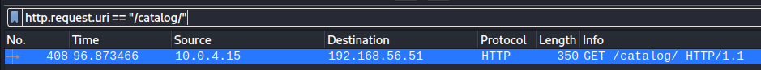

# Writeup - NukeTheBrowser from CyberDefenders
 
Herramientas: Wiresahark, Network Miner, Cyberchef, scdbg y Javascript Playground

Autor: Miquel Navarro

Dificultad: Difícil

Categoria: Network Forensics

### Q1. Multiple systems were targeted. Provide the IP address of the highest one.

En primer lugar, abriremos la captura .pcap con la aplicación Wireshark.
Accedemos a "Statistics > Conversations" abrimos el apartado de "IPv4" y ordenamos de manera descendente la lista "Address A".

### Q2. What protocol do you think the attack was carried over?

Para saber en que protocolo han realizado el ataque accedemos a "Statistics > Protocol Hierarchy Statistics" y podemos observar que se ha utilizado bastante el protocolo HTTP por lo que es probable que sea ese.

### Q3. What was the URL for the page used to serve malicious executables (don't include URL parameters)?

Para encontrar la URL, siguiendo los paquetes en orden en Wireshark, en el paquete 178 observamos un GET sospechoso que resulta ser la página donde se enceuntran los ejecutables maliciosos.

Si accedemos a "Follow > TCP Stream" podemos ver la página exacta de donde se descargan.

### Q4. What is the number of the packet that includes a redirect to the french version of Google and probably is an indicator for Geo-based targeting?

En este caso, filtraremos los paquetes con la opción "dns.qry.name == "www.google.fr"" ya que .fr nos indica que es perteneciente a Francia 

Nos fijamos en el número de los paquetes obtenidos y quitamos el filtro para ver los paquetes anteriores donde vemos que el paquete 299 es el que encuentra la página.

### Q5. What was the CMS used to generate the page 'shop.honeynet.sg/catalog/'? (Three words, space in between)

Filtramos los paquetes con "http.request.uri "/catalog/"" de forma que nos muestra el paquete exacto en el que tenemos dicha parte de la url.

Hacemos click derecho sobre el paquete y seleccionamos "Follow > HTTP Stream" de forma que podemos ver lo que ha ido sucediendo en el paquete HTTP. Siguiendo la "conversación" es donde observamos el CMS que se ha utilizado.

### Q6. What is the number of the packet that indicates that 'show.php' will not try to infect the same host twice?

Añadiendo "path" al filtro anterior podemos encontrar "/fg/show.php", esto lo sabemos puesto que lo hemos visto durante la investigación y para encontrar el paquete exacto de forma más rápida utilizamos dicho filtro.

Con este filtro vemos que hay dos paquetes con el mismo host, por lo que nos quedamos con los paquetes y seguimos sus conversaciones.

En primer lugar, el paquete 157 recibe respuesta en el paquete 174. Así que accedemos a "Follow > HTTP Stream" del paquete 174 y vemos que tiene un script con JavaScript ofuscado por lo que aquí realiza la infección.

Ahora cambiamos al paquete 358 el cual tiene la respuesta en el 366. Así que repetimos los pasos anteriores para ver si lo infecta de nuevo.

En este caso vemos que no encuentra la página así que podemos afirmar que solo infecta una vez a cada host.

### Q7. One of the exploits being served targets a vulnerability in "msdds.dll". Provide the corresponding CVE number.

Para encontrar el número CVE de la vulnerabilidad "msdds.dll" basta con realizar una búsqueda en nuestro navegador y lo obtendremos.

### Q8. What is the name of the executable being served via 'http://sploitme.com.cn/fg/load.php?e=8'?

Para saber esto lo que vamos a tener que hacer es desofuscar el JavaScript.
En primer lugar, buscaremos la primera respuesta que tenemos con OK en el protocolo HTTP siguiendo los paquetes, con un click derecho sobre el HTML seleccionamos "Show PAckeet Bytes".

Tras esto nos guardamos el archivo.

Ahora con una simple línea de comandos acotamos el archivo para desofuscarlo de forma correcta y lo guardamos con otro nombre.

Con el comando "js" ya lo tendremos desofuscado.

A continuación, vamos a la web de CyberChef y con la opción de "Jvascript Beautify" pasamos nuestro código y lo guardamos para poder leerlo en claro.

A partir de este punto, miramos las diferentes variables que nos encontramos y las pasamos por CyberChef con las opciones "Swap Endianness" y "From Hex". La variable que contiene el ejecutable que estamos buscando es "shellcode".

Nos guardamos la variable y nos cambiamos a una máquina Windows 10 donde tenemos la herramienta "scdbg" y le pasamos el archivo con las opciones "UnlimitedSteps" y "FindSc".

Por último, cuando termina la ejecución, obtenemos el nombre del ejecutable.

### Q9. One of the malicious files was first submitted for analysis on VirusTotal at 2010-02-17 11:02:35 and has an MD5 hash ending with '78873f791'. Provide the full MD5 hash.

Con la aplicación Network Miner obtenemos el MD5 entero del fichero malicioso.

### Q10. What is the name of the function that hosted the shellcode relevant to 'http://sploitme.com.cn/fg/load.php?e=3'?

Reutilizando el Javascript desofuscado anteriormente, volvemos a buscar entre las funciones con CyberChef y encontramos que la función que nos piden es "aolwinmap".

### Q11. Deobfuscate the JS at 'shop.honeynet.sg/catalog/' and provide the value of the 'click' parameter in the resulted URL.

Buscamos el paquete que contiene la url mencionada.

Con "Follow > HTTP Stream" buscamos el código JavaScript.

Con la herremienta online "Javascript Playground" le pasamod el código cambiando "document.write" por "console.log" y este nos saca el valor de "click".

### Q12. Deobfuscate the JS at 'rapidshare.com.eyu32.ru/login.php' and provide the value of the 'click' parameter in the resulted URL.

Buscamos el primer paquete que contenga la URL que se nos pide.

Como hemos hecho en el paso anterior lo pasamos a la herramienta "Javascript Playground" añadiendo "console.log" entre los parámetros "eval" y "function".

El recultado, lo pasaremos por CyberChef con la opción "URL Decode" el cual nos otorga el valor de "click" 

### Q13. What was the version of 'mingw-gcc' that compiled the malware?

Siguiendo el "HTTP Stream" del ejercicio anterior buscando por la palabro "ming" encontramos la versión.

### Q14. The shellcode used a native function inside 'urlmon.dll' to download files from the internet to the compromised host. What is the name of the function?

Pasandole el archivo de la pregunta 8 o el de la pregunta 10 por la herramienta "scdbg" obtenemos la función nativa dentro de "urlmon.dll" --> "URLDownloadToFile"

