# Writeup - Red Stealer from CyberDefenders
 
Herramientas: VirusTotal, icann, Malware Bazaar y Threat Fox

Autor: Miquel Navarro

Dificultad: Fácil

Categoria: Threat Intel

### Q1. Categorizing malware allows for a quicker and easier understanding of the malware, aiding in understanding its distinct behaviors and attack vectors. What's the identified malware's category?

Solo se nos otorga el sha-256 del archivo malicioso, así que lo analizamos con VirusTotal. Aquí se puede observar la categría en la que se ha identificado el malware.

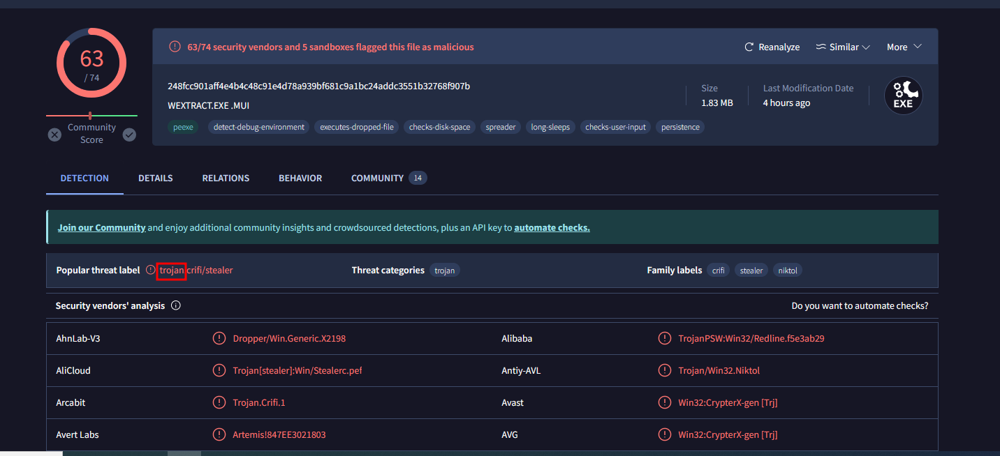

### Q2. Clear identification of the malware file name facilitates better communication among the SOC team. What's the file name associated with this malware?

Desde la primera parte del análisis que obtenemos podemos ver el nombre del malware.

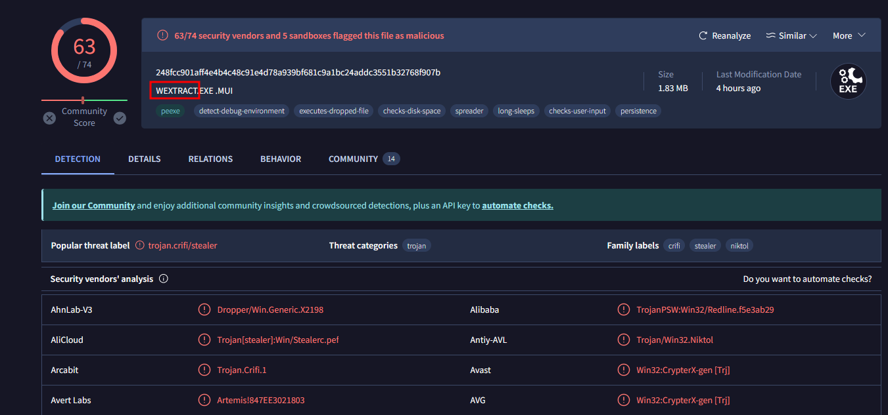

### Q3. Knowing the exact time the malware was first seen can help prioritize actions. If the malware is newly detected, it may warrant more urgent containment and eradication efforts compared to older, well-known threats. Can you provide the UTC timestamp of first submission of this malware on VirusTotal?

Desde el apartados de "Details" si buscamos un poco tenemos el apartado "History" donde nos especifica la primera fecha de lanzamiento del malware.

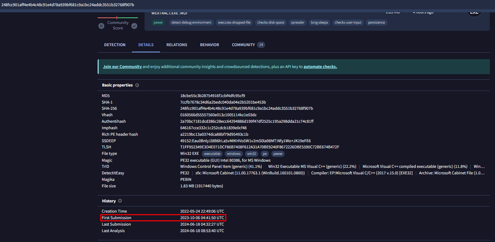

### Q4. Understanding the techniques used by malware helps in strategic security planning. What is the MITRE ATT&CK technique ID for the malware's data collection from the system before exfiltration?

Para este caso, encontramos el ID de la técnica del MITRE ATT&CK para la recolección de datos del sistema en el apartado "Behavior" en VirusTotal.

Para ello, nos vamos al subapartado "MITRE ATT&CK Tactics and Techniques", dentro de este tenemos "Collection" que a su vez tiene un apartado específico para los datos del sistema "Data from Local System" con el ID "T1005".

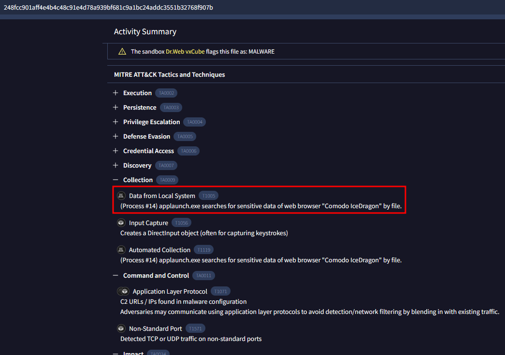

### Q5. Following execution, what domain name resolution is performed by the malware?

Siguiendo con la búsqueda dentro de "Behavior" nos encontramos con "HTTP Requests" y "DNS Resolutions" donde podemos ver que en el primero hay bastantes conexiones a facebook y en el segundo existe el DNS www.facebook.com.

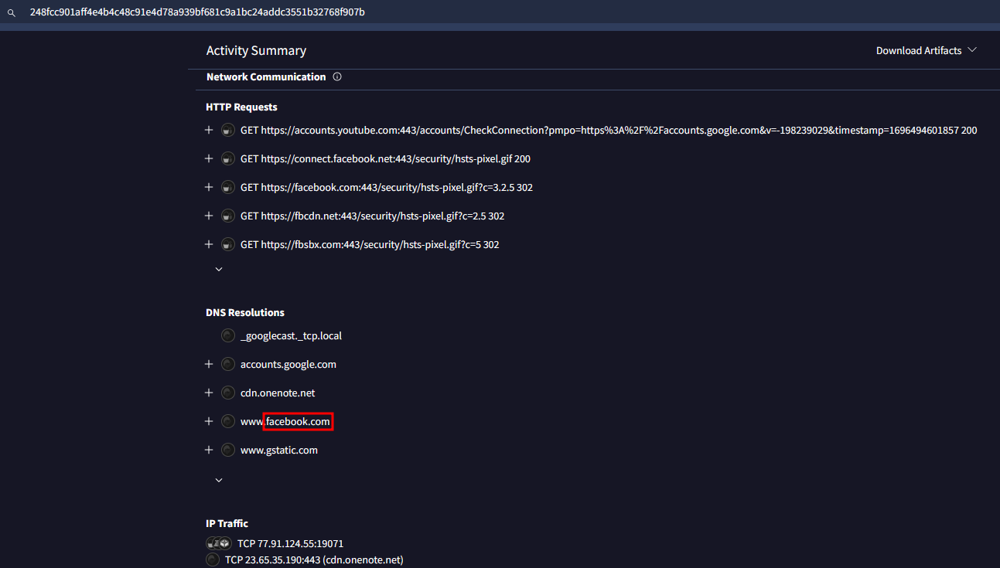

### Q6. Once the malicious IP addresses are identified, network security devices such as firewalls can be configured to block traffic to and from these addresses. Can you provide the IP address and destination port the malware communicates with?

Desde el mismo apartado podemos apreciar la IP y el puerto con el que el malware se comunica.

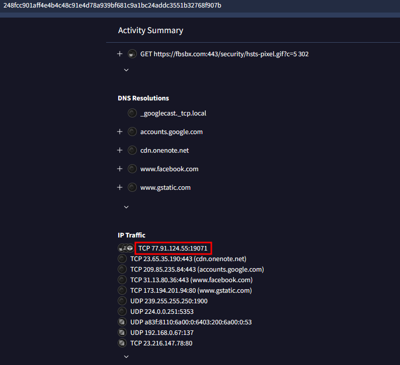

### Q7. If a hosting service is frequently used for malicious activities, security teams can implement a strict filtering rules for all traffic to and from the IPS belonging to that hosting provider. What hosting service does the identified IP belong to?

Para saber a que hosting pertenece la IP encontrada anteriormente, nos movemos a cualquier analizador de base de datos donde se busca información del propietario del dominio y del ip, en este caso yo he utilizado icann[.]org, pero existen varias opciones como puede ser who[.]is

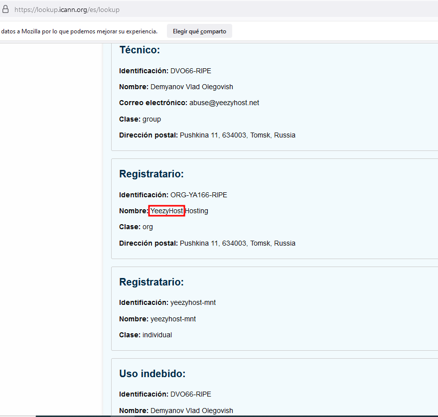

### Q8. YARA rules are designed to identify specific malware patterns and behaviors. What's the name of the YARA rule created by "Varp0s" that detects the identified malware?

Para saber que regla ha creado "Varp0s", basta con entrar a la página "Malware Bazaar", en esta filtramos con "tag:wextract" para encontrar el nombre del malware que buscamos.

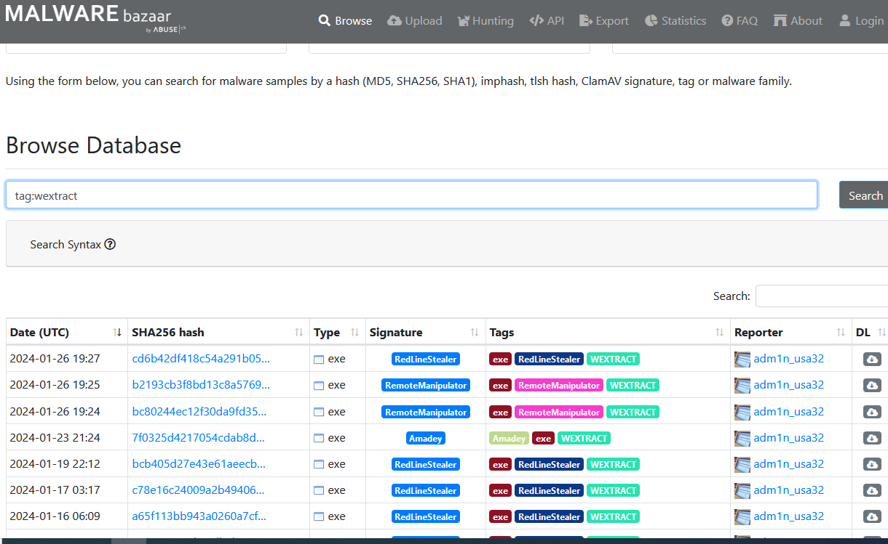

Dentro de cualquiera de las opciones que nos ofrece la página podremos encontrar los "YARA Signatures" y buscaremos la que ha sido creada por "Varp0s".

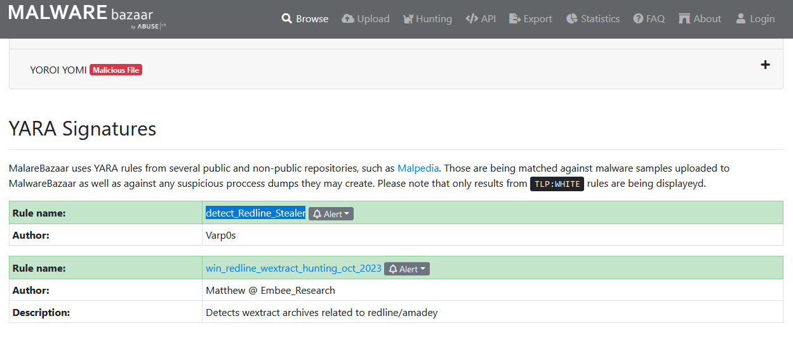

### Q9. Understanding which malware families are targeting the organization helps in strategic security planning for the future and prioritizing resources based on the threat. Can you provide the different malware alias associated with the malicious IP address?

Con la página "Threat Fox" podemos ver diferentes indicadores de compromiso, así que filtrando tanto por el tipo del malware que tenemos o por el listado de IPs maliciosas que tenemos, podemos ver el alias del malware.

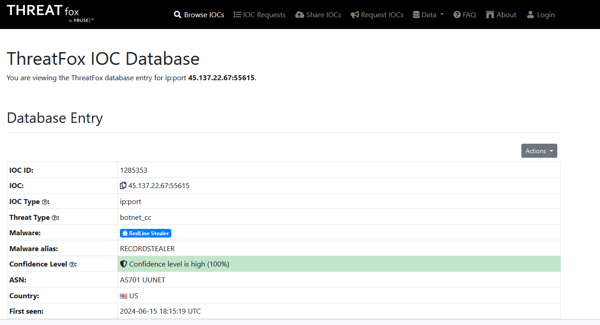

### Q10. By identifying the malware's imported DLLs, we can configure security tools to monitor for the loading or unusual usage of these specific DLLs. Can you provide the DLL utilized by the malware for privilege escalation?

Con algunos conocimientos sobre escalada de privilegios y viendo las tácticas y técnicas del MITRE ATT&CK podemos encontrar que DLL utiliza el malware para realizar la escalada de privilegios desde el análisis que nos ofrece VirusTotal.

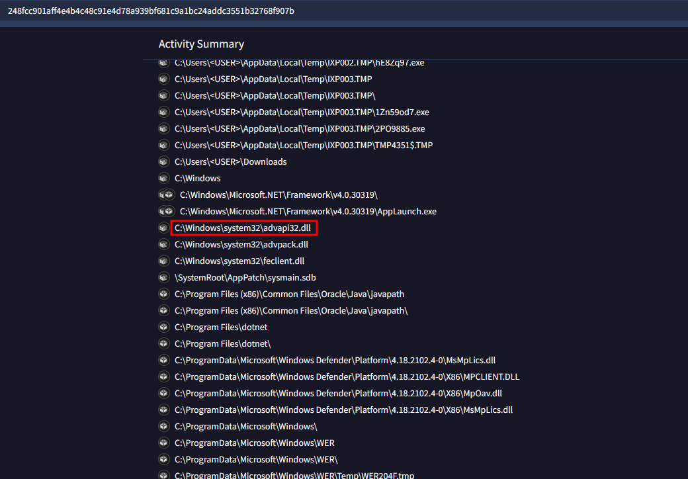
